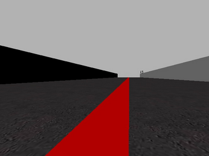
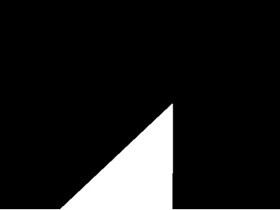
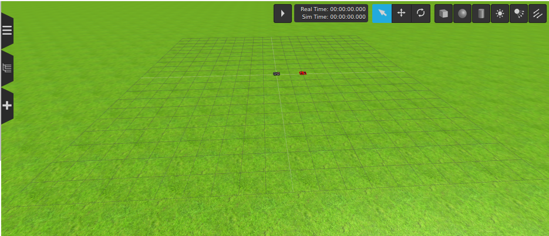
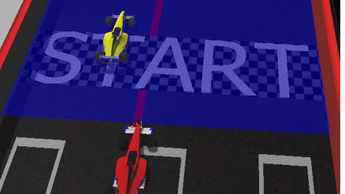
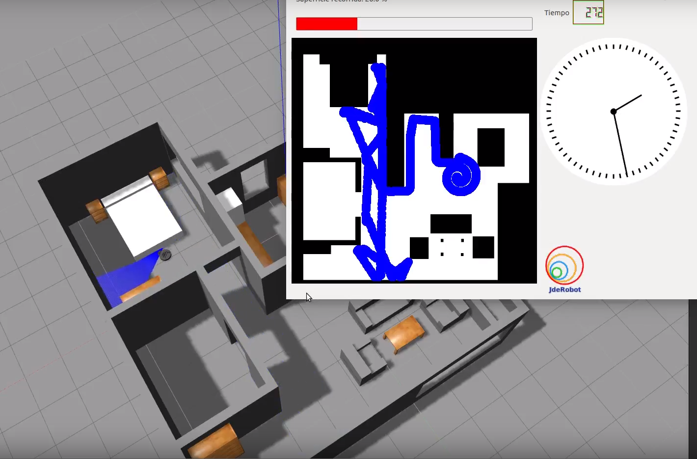
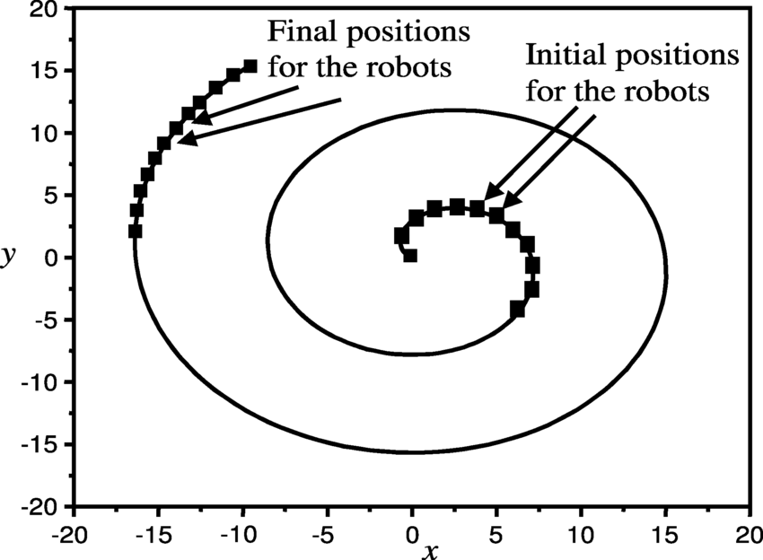
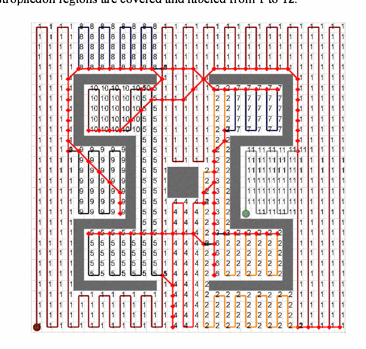

## Welcome to my R0b0tic BLOG

I will post my homeworks of Robotic.

### Work Practices

These are my work practices: 
   

<h1> <b>1. Follow Line </b></h1>
The goal is to complete a lap following the line painted on the racing circuit.
We will use the plataform created by <a href="https://jderobot.github.io/RoboticsAcademy/ " >JDeRobot</a> with the lenaguage of programming called Phyton.
   
<h2><b>INTRODUCTION TO THE PRACTICE FOLLOW LINE: </b> </h2>
   

   
<h2>The first implement: <b>The case-based program</b></h2>
It is a conditional control structure that appears in most modern programming languages and allows a selection to be made   between several sets of program statements; the choice is dependent on the value of some expression. The case statement is a  more general structure than the <b> if then else statement,</b> which allows a choice between only two sets of statements.

<h2> The second implement: The PID controller</h2>
The name of PID stands for Proportional-Integral-Derivative. These three controllers are combined in such a way that it produces a control signal. As a feedback controller, it delivers the control output at desired levels. I have to admit that with that alteration in my code including the PID controller the Formula one has improve a lot the circulation in the race circuit. For more information you car learn about more of the PID controler in this video I linked:

<pre>
  <iframe width="560" height="315" src="https://www.youtube.com/embed/v27xYKdZUzI" frameborder="0" allow="accelerometer; autoplay; encrypted-media; gyroscope; picture-in-picture" allowfullscreen></iframe>
</pre>

   
### The Image Processing
In this practice i have used an important robotic sensor. This sensor is <b>the camera sensor</b> who gives a lot of information. The camera is a cheap sensor and i think it is the best price quality sensor in the market.
In this practice i do an image processing. Firts i get the <b> RSV image</b> and <b> I convert into a HSV image</b>. Then i create a mask for this imagen and filetered to get a <b> Binary Image</b> to get more information from the image and use it to create the code to redirect the car following the red line in the race circuit.

<figure class="align-center">

     
RGB IMAGE 
   
  
 
   
HSV IMAGE
   

 
   
BINARY IMAGE
   
</figure>

   
### The case-based program:

This type is very easy i only count the error between pixels from right to left and i write in the angular velocity this error.This is a video of mpowery case-based program with the Formula One in the practice:

<pre>
<iframe width="560" height="315" src="https://www.youtube.com/embed/KFF2EVhh_rk" frameborder="0" allow="accelerometer; autoplay; encrypted-media; gyroscope; picture-in-picture" allowfullscreen></iframe>
</pre>

   
### The PID controller:
In this part of the program i calcuate the error in another form. I think this way to calculate the error its more efficient. i calculate the center of the image of the simulator and then i calculate i all moments the exact middle of the image that the camera provides me. With this "desviation" ussing a loop in the code saving the last 10 errors. I can compare to get the derivate part from the PID and I can sum all the errors to get the Integral part to get all the components fo the PID.This is a vdieo of my PID program powerwith the Formula One in the practice: 

<pre>
  <iframe width="560" height="315" src="https://www.youtube.com/embed/PWc_PTr9I_M" frameborder="0" allow="accelerometer; autoplay; encrypted-media; gyroscope; picture-in-picture" allowfullscreen></iframe>
</pre>

   
   
   
<h1><b>2. Drone_cat_mouse</b></h1> 
   
<h2><b>INTRODUCTION TO THE PRACTICE DRONE CAT MOUSE:</b> </h2>

The goal of this practice is that the black drone (cat) needs to follow the red one (mouse) in an open field map delimited by ficticial lines.

In this practice I use the languague of programming python an the library cv2. I use in especial this library for image processing (from de drone) and to use different logic methods for robots implmented in that library.
   

   
### The Image Processing

This part is very important due to with this image processing we can detect the other drone and we follow it. i use the sensor of the camera and with the help of the  cv2 library i filtered the imagen and i get the dorne filetreed.
   
### The drone controller

First i used a case-based controller but this cas -based program was very inneficient and the drone sometimes lost the red drone. Then i implement the another way and the black drone (the cat) mproves a lot the way he follos the red dorne (the mouse). 

   
   
   
<h1><b>3. Obstacle Avoidance Practice</b></h1>
   
<h2><b> INTRODUCTION TO THE: Obstacle Avoidance Practice </b> </h2>
The objective of this practice is to implement the logic of the VFF navigation algorithm to control a F1 Robot as the one shown in the next image. In this practive we have to improve the code due to the fact we need to complete the entire circuit avoiding the obstacles that the car will find with the sensors.

Although our code will be reactive-method-based like the other codes from the first practices, we will require a map to show us the location of the targets we are to reach. This target are marked with a yellow Cross.

   
### SENSORS
In this practice we use 2 important sensors:

   <b>1. The laser sensor</b>
   
   <b>2. The Location of the robot</b>
   
### VFF ALGORITHM
Navigation using VFF (Virtual Force Field), consists of:

Each object in the environment generates a repulsive force towards the robot.

Destiny generates an attractive force in the robot.

This makes it possible for the robot to go towards the target, distancing itself of the obstacles, so that their address is the vector sum of all the forces.

   
### HOW WE IMPLEMENT VFF ALGORITHM

To implement VFF algorithm i used an hybrid navigation. This hybrid navigation is formed by global navigation and local navigation.

First, we need to know the absolute coordinates from the robot (x, y, yaw).

Second, we need to obtain the absolute coordinates from the next target.

Next, we need to calculate the relative coordinates from my robot from the previous absolute coordinates.

Then, we need to obtain the sensor data wo has an array of 180 position. Each position has a value, this value is the ditance from your robot to the obstacle.

Finally, we obtain the relative coordinates form the robot and we have to implement that process in the VFF algorithm.
   

   
### WHAT CONTAINS THE VFF ALGORITHM
   
The VFF algorith contais 3 types of forces. This forces are:

<b>Attractive Force (Green vector)</b>

First of all I used the absolute2relative() method to change the coordinates of the targets from absolutes to relatives coordinates.

Then, I calculate this Attractive force with the X (self.carx) and Y (self.cary) coordinates that I take from target. This target was formed by module and phase. The module has to be constant in order the force doesn’t increase uncontrollably.

<b>Repulsive Force (Red vector)</b>

To calculate that Repulsive force i used the infromation obtained from the laser. Using this infromation i obtained the repulsive vector and created using np.mean. 

<b>Resultant Force (Black vector)</b>

I calculated the Resultant force with the sum of the Attrative force and the Repulsive force.
   

   

This was an execute of my code with the VFF Algorithm in the Online plataform of JdRObot: 
   

<pre>
  <iframe width="560" height="315" src="https://www.youtube.com/embed/nlX39X07YWA" frameborder="0" allow="accelerometer; autoplay; encrypted-media; gyroscope; picture-in-picture" allowfullscreen></iframe>
</pre>

   
<h2><b> My Issue </b> </h2>

I had a problem with the practice because the online plataform fall down and the only way to solve the prcatice and to reach the goal was using the offline plataform. For me this was a problem due to the fact that I have a Macbook with MacOS and this S.O have incompatibilities with linux and running the code in a VM with linux decreased a lot the performance and the possibility to run the code in my comupter with a good flexibility using gazebo and the code at the same time. Due to the fact that the perfomance decreased my teacher of Robotic found me a possibilitie to run gazebo without the graphic interfaz. Only runing the solucion without using the simulator gazebo, I can't see the simulator of the car running the circuit but I could see the solution of my code and the vectors from the car.
 
At first this was so difficult I had the challengue that i have to understand very well the way the vectors works and the VFF algorithm. I create first a code that doesn´t work i have and idea of what i have to do beacuse in the online plataforme i did the practice but in the offline plataform was different but the essence was there. 

This was my first proof of my code running only the solucion of my code:
   

<pre>
  <iframe width="560" height="315" src="https://www.youtube.com/embed/erEbsWirIc8" frameborder="0" allow="accelerometer; autoplay; encrypted-media; gyroscope; picture-in-picture" allowfullscreen></iframe>
</pre>

   
After many failed attemps I obtain one solution that works but touch the walls of the cirucit and that decrease the lineal velocity. This is an example: 
   

<pre>
  <iframe width="560" height="315" src="https://www.youtube.com/embed/fQMPrYmGCtI" frameborder="0" allow="accelerometer; autoplay; encrypted-media; gyroscope; picture-in-picture" allowfullscreen></iframe>
</pre>

   
Finally i reach my goal. I create a code that the robot never touch the walls of the circuit and goe very well decreasing the velocity when he see a target and increasing the angular speed to avoid it and increasing the linear speed when he see only the road with any target.

This is an example of my final solution running the final code:
   

<pre>
  <iframe width="560" height="315" src="https://www.youtube.com/embed/PZU6-7f6dZs" frameborder="0" allow="accelerometer; autoplay; encrypted-media; gyroscope; picture-in-picture" allowfullscreen></iframe>
</pre>

   
   
   
<h1><b>4. Vacuum cleaner</b></h1>
   

   
<h2><b> INTRODUCTION TO THE: Vacuum cleaner </b> </h2>

In this practice we need to implement the logic of a navigation algorithm for an autonomous vacuum. The main objective will be to cover the largest area in 300 seconds of a house using the programmed algorithm. This algorithm is called <b>Coverage Algorithm.</b>
   
<h2><b> COVERAGE ALGORITHM </b> </h2>

Coverage Path Planning is an important area of research in Path Planning for robotics, which involves finding a path that passes through every reachable position in its environment.

We can analyze in the movements in to two ways:

<b>1.- Spiral Motion.</b>
   

   
<b>2.- Boustrophedon Motion.</b>
   

   
### Generate the Movement
   
To generate the movement we have to create a way to found an angle generation.

Top create this angle we can use a <b>random durantion or a random angle</b> changing all the time the angle of the robot with a velocity to clean and to move i all directions.

I choose the random angle way. i generate all time random angle using the distancia between the walls and the robot and i gerenate different speeds in different directions.

   
### Components of this Practice
   
We use this components to generate de movement of the vaccum:

1.- Sensor with 180 values.

I obtain all the data form the laser sensor <b>(laser.getLaserData()).</b> With this data I calculate the angle to generate a random angle. The valiue of thsi angle will depends of the distance of the robot and the walls of the house. The are related.

For example one case is that if we are very near a wall we will return in another direction to contiue cleaning and no going only in the same direction to the wall.
   

   

2.- The motors of the robot to generate the speed.

   
### The practice running
   
When we run the practuce without the head of gzabeo we only see the refeere. this isnt a problem because we have <b>"the eyes of the robot"</b> we dont need <b>"the eyes of god"</b>. First of all we start aprox at the middle of the house and when we launch our code the vacuum starts cleaning. 
   
### EXAMPLE OF MY SOLUTION
   

<pre>
<iframe width="560" height="315" src="https://www.youtube.com/embed/noeqeZSxC74" frameborder="0" allow="accelerometer; autoplay; encrypted-media; gyroscope; picture-in-picture" allowfullscreen></iframe>
</pre>

   

### Comments
   

### Support or Contact
   
r.garciasa.2017@alumnos.urjc.es
Department of R0b0tics. URJC.
