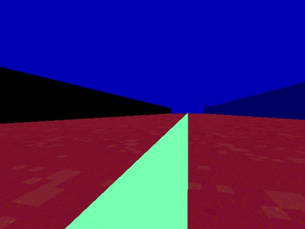

## Welcome to my R0b0tic BLOG

I will post my homeworks of Robotic.

### Work Practices

These are my work practices: 

### 1. Follow Line 
The goal is to complete a lap following the line painted on the racing circuit.
We will use the plataform created by <a href="https://jderobot.github.io/RoboticsAcademy/ " >JDeRobot</a> with the lenaguage of programming called Phyton.

### INTRODUCTION FOLLOW LINE: 

<h1>The first implement: <b>The case-based program</b></h1>
It is a conditional control structure that appears in most modern programming languages and allows a selection to be made   between several sets of program statements; the choice is dependent on the value of some expression. The case statement is a  more general structure than the <b> if then else statement,</b> which allows a choice between only two sets of statements.

<h2> The second implement: The PID controller</h2>
The name of PID stands for Proportional-Integral-Derivative. These three controllers are combined in such a way that it produces a control signal. As a feedback controller, it delivers the control output at desired levels. I have to admit that with that alteration in my code including the PID controller the Formula one has improve a lot the circulation in the race circuit. For more information you car learn about more of the PID controler in this video I linked:
<object width="420" height="315"
data="https://www.youtube.com/watch?v=v27xYKdZUzI">
</object>
<embed width="430" height="315"
src="https://www.youtube.com/watch?v=v27xYKdZUzI">

### The Image Processing
In this practice i have an important sensor of robots. This sensor is The camera sensor who gives a lot of information. The camera is a cheap sensor and i think it is the best price quality sensor in the market.
In this practice i do an image processing. Firts i get the <b> RSV image</b> and <b> I convert into a HSV image</b>. Then i create a mask for this imagen and filetered to get a <b> Binary Image</b> to get more information from the image and use it to create the code to redirect the car following the red line in the race circuit.

 
RGB IMAGE 

 
HSV IMAGE 

 
BINARY IMAGE 

### The case-based program:

This type is very easy i only count the error between pixels from right to left and i write in the angular velocity this error.

### The PID controller:
In this part of the program i calcuate the error in another form. I think this way to calculate the error its more efficient. i calculate the center of the image of the simulator and then i calculate i all moments the exact middle of the image that the camera provides me. With this "desviation" ussing a loop in the code saving the last 10 errors. I can compare to get the derivate part from the PID and I can sum all the errors to get the Integral part to get all the components fo the PID.
<object width="420" height="315"
data="https://youtu.be/PWc_PTr9I_M">
</object>
<embed width="430" height="315"
src="https://youtu.be/PWc_PTr9I_M">
https://youtu.be/PWc_PTr9I_M

### Comments

### Support or Contact

r.garciasa.2017@alumnos.urjc.es
Department of R0b0tics. URJC.
